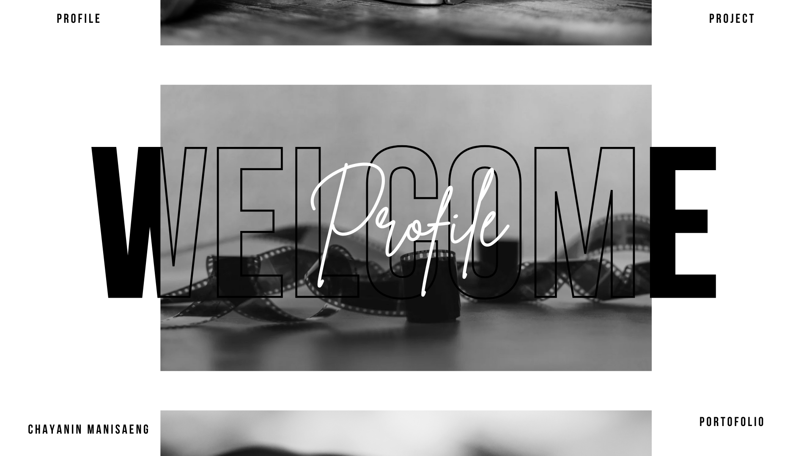

<!--Welcome to my GitHub profile! I'm an aspiring software developer with interests in front-end, back-end, and full-stack development. I'm continually learning and improving my skills in this exciting field.-->

<h2 align="center">About Me 👨‍💻</h2>

<!--I'm focused on enhancing my skills to become a proficient developer in the following areas:-->

<!--- **Front-end Development**: Creating engaging and interactive user interfaces.-->
<!--- **Back-end Development**: Building robust and scalable server-side applications.-->
<!--- **Full-stack Development**: Combining both front-end and back-end skills to develop comprehensive solutions.-->

- **Email**: [cyninn.4@gmail.com](mailto:cyninn.4@gmail.com)
- **LinkedIn**: [Chayanin Manisaeng](https://www.linkedin.com/in/chayanin-manisaeng-445176312/)

<h2 align="center">GitHub Stats 👨‍💻</h2>

|  |  |
| ------------- | ------------- |

    

  

⚙️ My development environment

  <table width="100%" style="font-size: 11px">
    <tr>
      <td align="center" valign="top">
        <h4>🖥️ Windows PowerUser</h4>
        
        
      </td>
      <td align="center" valign="top">
        <h4>🐧 Linux Enthusiast</h4>
        
      </td>
    </tr>
  </table>

<h2 align="center">Repositories 👨‍💻</h2>

Here are some of my projects :  
Internship :

Project in Class :

<h5 align="center">
  <a href="https://github.com/Chayanin086?tab=repositories" title="Show All Repositories">See More 🔍</a>
</h5>

<!-- You can add more sections here like Technologies I Use, Blogs, etc. -->

<!--## Hi there 👋-->

<!--
**bmyaye/bmyaye** is a ✨ _special_ ✨ repository because its `README.md` (this file) appears on your GitHub profile.
Here are some ideas to get you started:
- 🔭 I’m currently working on ...
- 🌱 I’m currently learning ...
- 👯 I’m looking to collaborate on ...
- 🤔 I’m looking for help with ...
- 💬 Ask me about ...
- 📫 How to reach me: ...
- 😄 Pronouns: ...
- ⚡ Fun fact: ...
-->
